# System Architecture Specification: Obsidian Mobile Plugin & Sync Backend

## 1. Executive Overview

The **Obsidian Plugin & Mobile Sync Backend** is an integrated knowledge-management system tailored for Obsidian on Android. It pairs a client-side TypeScript plugin with a self-hosted Python FastAPI backend to deliver:
1. **Lightweight, Zero-Loss Bidirectional Synchronization**: State diffing via xxHash manifests, debounced auto-sync, client-priority conflict resolution with external server archiving (`data/conflicts/` and `data/archive/`).
2. **AI-Assisted Note Workflows**: Google Gemini integration for YAML frontmatter generation, streaming inline text correction, and contextual note querying.
3. **Voice Note Transcription**: Android microphone audio capture with streaming or batch transcription into Markdown at the cursor.
4. **Zero-Port Exposure Security**: Designed to run behind a reverse proxy or tunnel (Cloudflare Tunnel, Tailscale, Nginx, Caddy) routed to local port `5125` with secure Bearer header authentication.

---

## 2. High-Level Component Architecture

```mermaid
graph TD
    subgraph Clients["Cross-Platform Client Ecosystem"]
        subgraph MobileClient["Android Mobile (Obsidian App)"]
            MobileUI["Mobile Toolbar & Action Modal"]
            MobileCrypto["Web Crypto (SubtleCrypto)<br/>AES-256-GCM + PBKDF2"]
            MobileSync["xxhash-wasm Sync Engine"]
        end

        subgraph WindowsClient["Windows Desktop (Obsidian App)"]
            WinUI["Desktop Sidebar & Context Menu"]
            WinCrypto["Web Crypto (SubtleCrypto)<br/>AES-256-GCM + PBKDF2"]
            WinFS["Local FileSystem Direct Adapter<br/>(Optional Sync Bypass)"]
            WinSync["xxhash-wasm Sync Engine"]
        end

        subgraph WebExtension["Browser Extension (Manifest V3)"]
            ExtPopup["Popup (400x600) & Tabs<br/>Obsidian Native CSS Tokens"]
            ExtCrypto["In-Memory Web Crypto<br/>AES-256-GCM + PBKDF2"]
            ExtAi["AI SSE Stream Consumer<br/>(Metadata, Fix Text, Prompt)"]
            ExtWorker["Background Service Worker<br/>(Sync & Token Storage)"]
        end
    end

    subgraph Tunnel["Network Transport"]
        CFTunnel["Reverse Proxy / Tunnel Gateway<br/>(HTTPS Ingress :5125)"]
    end

    subgraph DockerHost["Docker Backend Host (Port 5125)"]
        API["FastAPI REST & SSE Gateway<br/>(Auth Bearer & X-Auth-Token Guard)"]
        SyncCtrl["Sync Controller<br/>(Manifest Diff & LWW Engine)"]
        AiCtrl["AI Controller<br/>(Gemini 2.5 Flash / Whisper)"]
        ManifestDB["SQLite Manifest DB<br/>(sync_manifest.db)"]
        
        subgraph Storage["Host Storage Volumes"]
            LiveVault["Active Vault Directory<br/>(/data/vault)"]
            ArchiveDir["Safe Archive Directory<br/>(/data/archive)"]
            ConflictsDir["Conflict Backup Directory<br/>(/data/conflicts)"]
            ConfigDir["Configuration Directory<br/>(/data/config/.env)"]
        end
    end

    MobileSync -->|"HTTPS"| CFTunnel
    WinSync -->|"HTTPS (If Enabled)"| CFTunnel
    WinFS -->|"Direct Local Disk I/O"| WinLocalDisk["Local Vault Filesystem"]
    ExtWorker -->|"HTTPS"| CFTunnel
    ExtAi -->|"SSE / REST"| CFTunnel

    CFTunnel -->|"Reverse Proxy -> Port 5125"| API
    API --> SyncCtrl
    API --> AiCtrl
    SyncCtrl --> ManifestDB
    SyncCtrl --> LiveVault
    SyncCtrl --> ArchiveDir
    SyncCtrl --> ConflictsDir
    ConfigDir -.->|"Injected Config"| API
```



---

## 3. Topography & Directory Layout

```text
obsidian_plugin/
├── client/                      # Obsidian Plugin (TypeScript)
│   ├── src/
│   │   ├── main.ts              # Plugin lifecycle (onload, registerRibbon, registerCommands)
│   │   ├── settings.ts          # Plugin settings tab & storage
│   │   ├── sync/                # Sync manager, xxhash-wasm manifest, diffing engine
│   │   ├── ai/                  # AI service (metadata, streaming edit, prompt, audio)
│   │   └── ui/                  # Mobile Action Modal, Voice recorder modal
│   ├── package.json             # NPM dependencies (obsidian, xxhash-wasm, esbuild)
│   ├── tsconfig.json
│   ├── esbuild.config.mjs
│   └── manifest.json            # Obsidian plugin manifest
├── extension/                   # Standalone Web Extension (Manifest V3)
│   ├── manifest.json            # MV3 configuration (action, storage, activeTab)
│   ├── popup.html               # 400x600 Companion UI
│   ├── popup.ts                 # State controller (Capture, Protected, AI Tools)
│   ├── background.ts            # Background service worker
│   ├── theme.css                # Obsidian native CSS design tokens
│   ├── crypto/ext_crypto.ts     # In-memory AES-256-GCM browser crypto
│   ├── ai/ext_ai_service.ts     # Fetch SSE streaming client
│   └── package.json
├── server/                      # FastAPI Backend (Python 3.11+)
│   ├── app/
│   │   ├── main.py              # FastAPI app initialization & CORS/Auth middlewares
│   │   ├── config.py            # Pydantic Settings loading from data/config/.env
│   │   ├── auth.py              # Bearer & secure header verification
│   │   ├── routers/
│   │   │   ├── sync.py          # /api/sync/status, /upload, /download, /delete
│   │   │   └── ai.py            # /api/ai/metadata, /edit, /prompt, /transcribe
│   │   ├── services/
│   │   │   ├── sync_service.py  # Manifest diffing, LWW, conflict/archive handling
│   │   │   ├── ai_service.py    # Gemini client & Whisper transcription
│   │   │   └── db_service.py    # aiosqlite manifest persistence
│   │   └── models/
│   │       ├── sync_models.py   # Pydantic request/response schemas
│   │       └── ai_models.py     # AI request/response schemas
│   ├── tests/                   # Pytest automated test suites (>=75% coverage)
│   ├── pyproject.toml
│   ├── requirements.txt
│   └── Dockerfile
├── infra/                       # Infrastructure & Deployment
│   └── docker-compose.yml       # Docker Compose mapping port 5125 and volumes
├── data/                        # Local runtime data & config (excluded in .gitignore)
│   ├── config/
│   │   ├── .env.example         # Version-controlled configuration template
│   │   └── .env                 # User credentials & paths (ignored)
│   ├── vault/                   # Active synced Markdown notes
│   ├── archive/                 # Soft-deleted notes
│   └── conflicts/               # Preserved server conflict versions
└── docs/                        # Project documentation suite
    ├── technical_specification.md
    ├── system_architecture.md
    ├── roadmap.md
    ├── dependencies.md
    └── Changelog.md
```

---

## 4. Synchronization Protocol & Conflict Strategy

### 4.1. Handshake Flow (`POST /api/sync/status`)
1. Client scans local vault, filtering notes with updated `mtime`.
2. Client computes 64-bit `xxhash-wasm` on modified notes.
3. Client posts `{ clientFiles: { path: hash }, deletedOnClient: [path] }`.
4. Server reconciles client hashes with `sync_manifest.db`:
   - Files deleted on client $\to$ moved to `/data/archive/<path>` and recorded in `acknowledgedDeletions`.
   - Files with newer/different client hashes $\to$ returned in `toUpload`.
   - Files present on server but missing/different on client $\to$ returned in `toDownload`.

### 4.2. Safe Archiving & Conflict Avoidance
- **Client Priority**: If a file is concurrently modified on both client and server, the client version takes precedence.
- **Zero Data Loss Guarantee**: Before overwriting the server file during `POST /api/sync/upload`, the server copies the existing server file to `/data/conflicts/<filename>_conflict_<YYYYMMDD_HHMMSS>.md`.
- **External Archive**: Both `/data/conflicts/` and `/data/archive/` reside strictly **outside** the active vault root (`/data/vault/`), ensuring desktop Obsidian and search engines never index stale or conflict files.

---

## 5. AI Capabilities & Streaming Protocols

1. **Metadata Generation (`POST /api/ai/metadata`)**:
   - Ingests full note content + list of existing vault tags.
   - Prompts Gemini with structured output requirements to return `{ title, description, tags }`.
   - Client updates/inserts standard YAML frontmatter `--- ... ---`.
2. **Inline Text Correction (`POST /api/ai/edit`)**:
   - Supports Server-Sent Events (SSE) `text/event-stream`.
   - Streams corrected tokens directly into the Obsidian active editor selection.
3. **Contextual Custom Prompt (`POST /api/ai/prompt`)**:
   - Injects full open note context into the user's custom question.
   - SSE streaming response for rapid user feedback.
4. **Voice Transcription (`POST /api/ai/transcribe`)**:
   - Accepts multipart audio (`audio/webm` or `audio/mp4`).
   - Delegates to Google Gemini Audio or cloud Whisper API, returning formatted text.

---

## 6. Security, Authentication & Configuration

- **Configuration Path**: All environment variables are loaded from `data/config/.env` using Pydantic Settings.
- **Port Binding**: Host port `5125` $\to$ Docker container port `5125`.
- **Pre-Shared Bearer Token**: All requests must supply `Authorization: Bearer <AUTH_TOKEN>` or `X-Auth-Token: <AUTH_TOKEN>`.
- **TLS & Reverse Proxy Integration**: An optional reverse proxy or tunnel (Cloudflare Tunnel, Caddy, Nginx) handles TLS termination for custom domain names. The backend validates the authentication header before any request is processed.

---

## 7. Protected & Encrypted Notes Subsystem

### 7.1. Zero-Knowledge Cryptographic Model
- **Native Web Crypto**: Uses browser-native `crypto.subtle` available in Android WebView, requiring zero third-party cryptographic binaries.
- **Key Derivation (PBKDF2)**: HMAC-SHA256 with 100,000 iterations and a 16-byte cryptographically secure random salt generated via `crypto.getRandomValues()`.
- **Cipher (AES-256-GCM)**: 256-bit symmetric key with a 12-byte random Initialization Vector (IV). The 128-bit authentication tag ensures data integrity and prevents undetected tampering.

### 7.2. In-Memory Editor & Disk Leak Prevention
- **Obsidian Auto-Save Isolation**: Unlocked notes render inside a custom `EncryptedNoteView` leaf (`ItemView`) rather than standard `MarkdownView`. This completely disconnects the plaintext buffer from Obsidian's background disk-writing engine.
- **Armored Storage Format**: The `.md` file retains standard YAML frontmatter with `encrypted: true` for tag and file indexing, while the body contains ASCII-armored ciphertext:
  ```markdown
  ---
  encrypted: true
  title: Protected Note
  tags: [secure]
  ---
  -----BEGIN PROTECTED NOTE-----
  Salt: <Base64 Salt>
  IV: <Base64 IV>

  <Base64 Ciphertext + Tag>
  -----END PROTECTED NOTE-----
  ```
- **Lifecycle & Auto-Lock**: Plaintext buffers and derived keys are automatically wiped from memory:
  - After 5 minutes of inactivity (`setTimeout` reset on keystrokes).
  - When the mobile app is minimized or sent to the background (`document.visibilityState === 'hidden'`).
  - Upon clicking `[ 🔒 Lock ]` or closing the tab.
- **Re-encryption & Decryption**:
  - `Save & Encrypt`: Encrypts the buffer with the active password and updates the vault file.
  - `Remove Password`: Decrypts the body, removes `encrypted: true`, restores plain Markdown file, and opens standard Obsidian editor.

